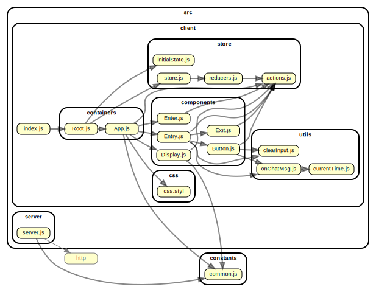

# Chat Room Demo

A demo implementation of a chat room that is using websockets protocol with socket.io, React and Redux

# Commands

- `yarn server` to start server
- `yarn startDev` for both client and server. Then visit demo app in `http://localhost:1234/demo/`
- `yarn build` to build client
- `yarn visualize` to build graph

# Internal stucture

Here is a chart of how the package is set up:

- info `https://www.netlify.com/blog/2018/08/23/how-to-easily-visualize-a-projects-dependency-graph-with-dependency-cruiser/`

# Steps

- yarn
- Try `yarn visualize`. If it fails install system dependency `sudo apt install graphviz` and try again.
- Create graph folder in `./graph` path
- dependencygraph.svg is generated in ./graph folder

# Puppeteer and CircleCI

- `https://github.com/xfumihiro/jest-puppeteer-example`

### TODOS

- [x] Keep messages on refresh
- [x] Keep login status on refresh
- [x] Add validation
- [x] Tests -- puppeteer
  - [x] Setup
  - [x] Add tests
- [x] Deploy to server
- [x] Automation / CI--> Add Circle CI
- [x] Filter and enable small emoticons
- [x] Add which user is typing info in a layer
- [x] Use it with electron --> this may not be implemented
- [x] Storybook
- [x] Add firebase database and a sidebar list of users in chat room
  - [x] Model user in DB. User will have firstname, lastname, status (active/away/inactive). Status will be configured through a small pop up from list. Status will be configured only by the matching user that has the permission to do it
  - [x] Save user in firebase DB on login
  - [x] Get all users on display rendering and show them in BS table
  - [x] Delete User from Database on logout
  - [x] setup node env for firebase and production
  - [x] bug fix for build files with firebase --> removed package dependency and added it as external one with injecting scripti in index.html
- [x] Logout after an amount of time where the system is idle
  - [x] Detect no key and no mouse interaction
  - [x] Detect no focus
- [x] Attach files / images etc --> this may not be implemented
- [ ] Add more stories

# NOTES

- To start client and server with single command: `https://kb.iu.edu/d/afnz`
- Online Demo: `https://chatroomsimpledemo.herokuapp.com/`
- Firebase tutorials: `https://www.robinwieruch.de/react-firebase-realtime-database/`
- `https://www.npmjs.com/package/firebase`
- `https://howtofirebase.com/save-and-query-firebase-data-ed73fb8c6e3a`
- `https://gist.github.com/anantn/4325082`
