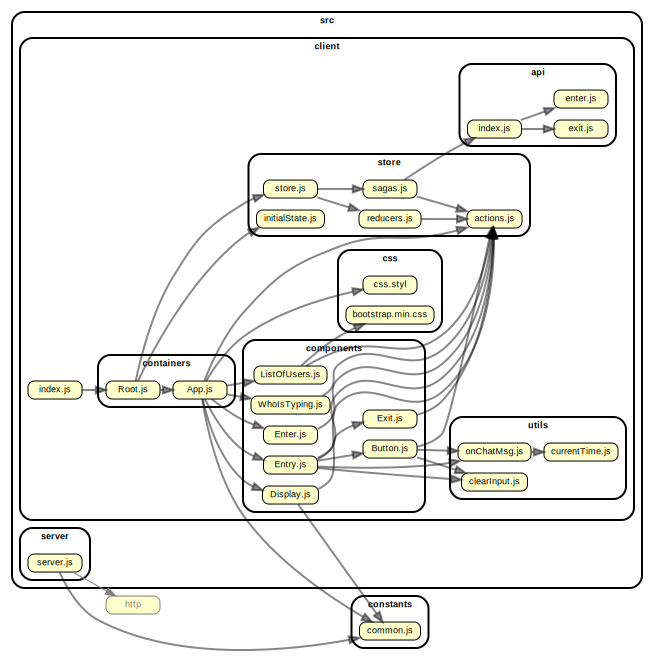

# Chat Room Demo
A demo implementation of a chat room that is using websockets protocol with socket.io, React and Redux

# Commands

- `yarn server` to start server
- `yarn startDev` for both client and server. Then visit demo app in `http://localhost:1234/demo/`
- `yarn build` to build client
- `yarn visualize` to build graph

# Internal stucture

Here is a chart of how the package is set up:

- info `https://www.netlify.com/blog/2018/08/23/how-to-easily-visualize-a-projects-dependency-graph-with-dependency-cruiser/`

# Steps

- yarn
- Try `yarn visualize`. If it fails install system dependency `sudo apt install graphviz` and try again.
- dependencygraph.svg is generated in ./graph folder

# Puppeteer and CircleCI

- `https://github.com/xfumihiro/jest-puppeteer-example`

### TODOS

- [x] Keep messages on refresh
- [x] Keep login status on refresh
- [x] Add validation
- [x] Tests -- puppeteer
  - [x] Setup
  - [x] Add tests
- [x] Deploy to server
- [x] Automation / CI--> Add Circle CI
- [ ] Filter and enable small emoticons
- [ ] Attach files / images etc --> this may not be implemented

# NOTES

- To start client and server with single command: `https://kb.iu.edu/d/afnz`
- Online Demo: `https://chatroomsimpledemo.herokuapp.com/`